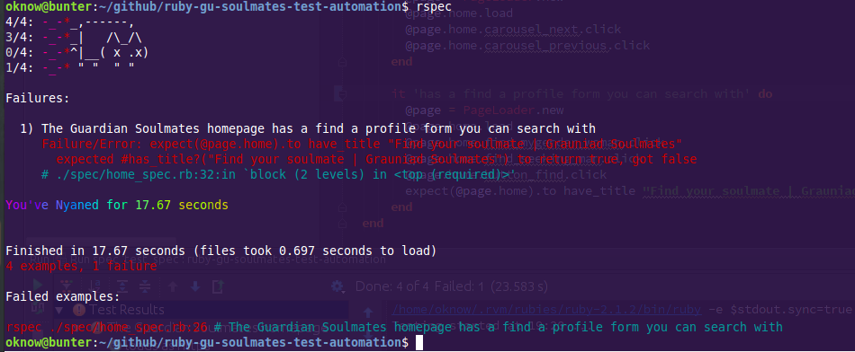

## Ruby test framework for Guardian Soulmates
*Meet someone worth meeting*

An exercise in old job meeting new job. After spending two years at The Guardian and the final 4 months on Guardian Soulmates testing a successful Worldpay to Stripe payment system migration, responsive design refactor, and a shiny new rebranding (with ligatures!) it's time to move on. 
  
This repository serves the purpose of implementing the new school with the old school. Long live The Guardian!  
  
Tools:  
Ruby tutorial: http://www.codecademy.com/en/tracks/ruby  
Ruby version manager: https://rvm.io  
RubyMine: http://www.jetbrains.com/ruby  
Siteprism: https://github.com/natritmeyer/site_prism  
Betterspecs: http://betterspecs.org/

